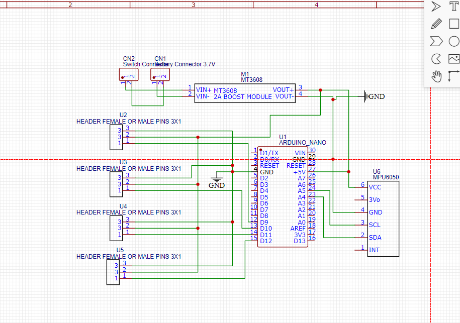
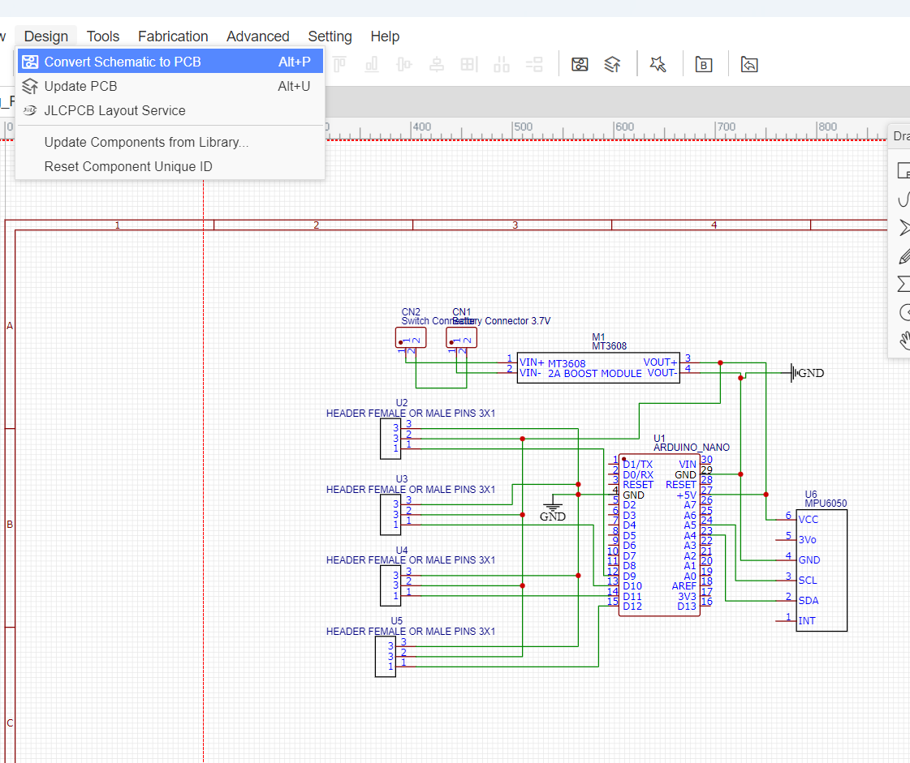
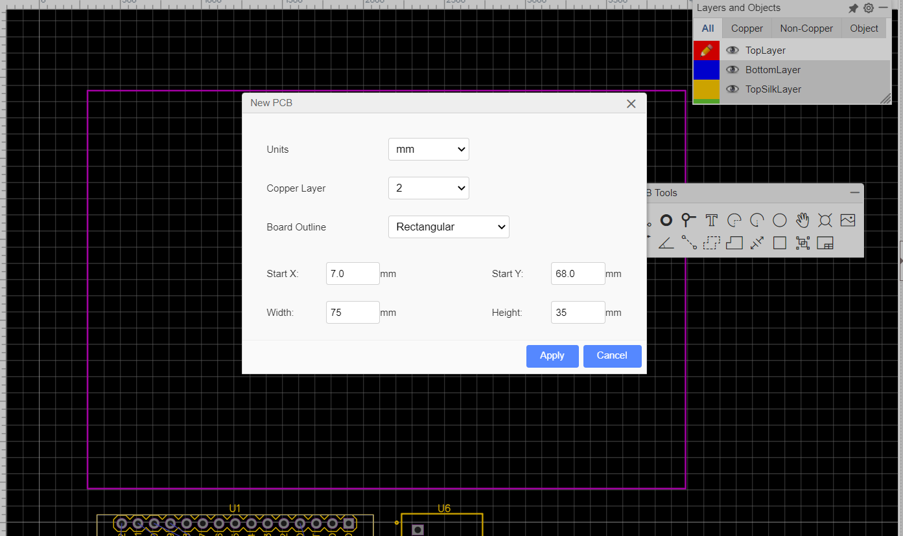
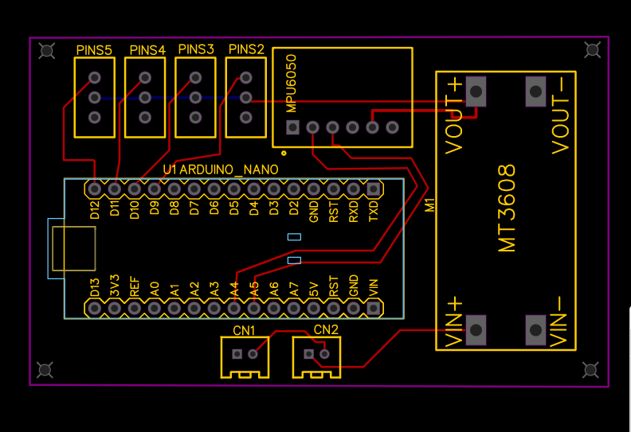
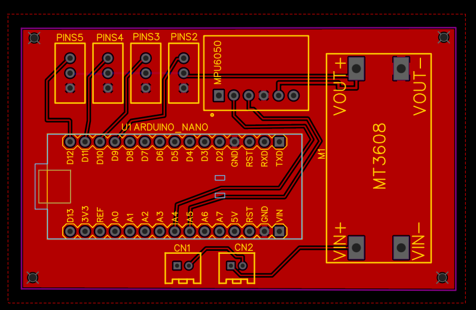
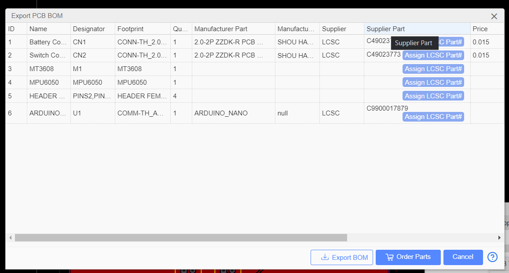
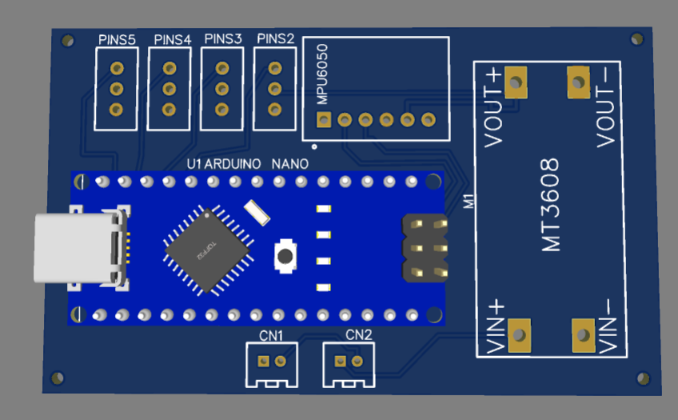
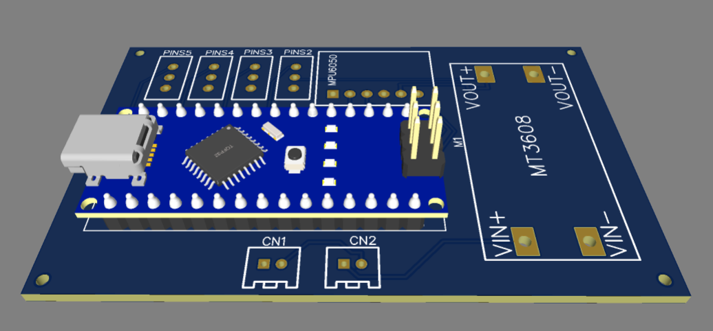
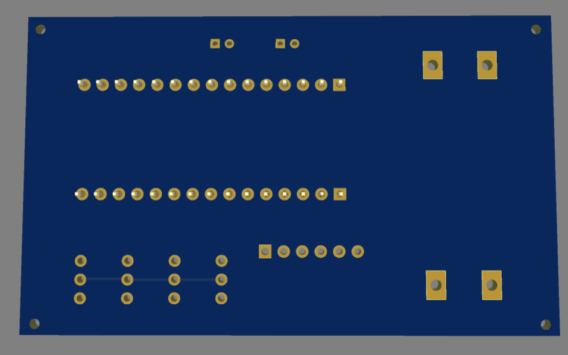

# 🐕 Robot Dog – Double-Layer PCB Design

## 📌 Project Overview

This project documents the implementation of a **PCB design task completed during my Robotics Engineering Internship at Smart Methods (الأساليب الذكية)** as part of the **Electronics & Electrical Power Engineering Track**.

The task was to design a **custom double-layer PCB for the quadruped robot dog using EasyEDA**, including the schematic, PCB layout, layer configuration, routing, Bill of Materials, and 3D PCB preview.

The PCB integrates the main electronic connections required for the robot, including:

* **Arduino Nano** microcontroller
* **MPU6050** accelerometer and gyroscope sensor
* **MT3608** DC-DC boost converter
* **Four 3-pin connectors** for the robot's servo motors
* **Battery input connector**
* **Power switch connector**
* Power and signal connections

---

## 🎯 Task Objective

The objective of this task was to apply the PCB design concepts learned during the internship by creating an organized PCB for the quadruped robot dog.

The required implementation included:

* Designing the electronic schematic
* Converting the schematic to PCB
* Configuring a **2-layer PCB**
* Organizing component placement
* Routing the electrical connections
* Applying a **Copper Area**
* Generating the **PCB BOM**
* Inspecting the completed board using **3D Preview**

---

## 🛠️ Design Tool

**EasyEDA**

---

# 🔄 PCB Design Process

## 1. Schematic Design

The task started by creating the electronic **Schematic** in EasyEDA.

The schematic defines the electrical connections between the Arduino Nano, MPU6050, MT3608, servo motor connectors, battery connector, and power switch.



---

## 2. Convert Schematic to PCB

After completing the schematic, the design was transferred to the PCB Editor using EasyEDA's:

**Design → Convert Schematic to PCB**



This transferred the components and their electrical connectivity from the Schematic Editor to the PCB Editor.

---

## 3. Board Outline & 2-Layer PCB Setup

The PCB was configured with the following settings:

* **Units:** mm
* **Copper Layer:** 2
* **Board Outline:** Rectangular
* **Width:** 75 mm
* **Height:** 35 mm

The two copper layers used in the design are:

* **TopLayer**
* **BottomLayer**

The **TopSilkLayer** was also used for component outlines, reference labels, and board markings.



---

## 4. PCB Layout & Route Tracks

After defining the Board Outline, the components were arranged inside the PCB area.

The electrical connections were then routed using **Tracks** across the available copper layers.

The PCB layout includes the:

* Arduino Nano
* MPU6050
* MT3608
* Four servo connectors
* Battery connector
* Power switch connector



This screenshot shows the PCB layout after routing and before applying the Copper Area.

---

## 5. Copper Area

After completing the required Track routing, a **Copper Area** was added to the PCB.



The Copper Area provides a filled copper region on the selected PCB layer while maintaining the required clearances around pads and Tracks.

---

# 📋 Export PCB BOM

EasyEDA's **Export PCB BOM** function was used to generate the **Bill of Materials (BOM)** for the PCB.



The BOM documents information about the components used in the board, including:

* Designator
* Component name
* Footprint
* Quantity
* Manufacturer information
* Supplier information

The exported BOM is included in this repository:

`BOM_Robot_Dog_PCB_.csv`

---

# 🧊 3D Preview

After completing the PCB layout, EasyEDA's **3D Preview** was used to inspect the physical arrangement of the board and its components.

## Top View



The Top View shows the placement of the Arduino Nano and the other major PCB components.

---

## Perspective View



The Perspective View provides a clearer representation of component placement, height, and the overall physical layout of the board.

---

## Bottom View



The Bottom View shows the underside of the PCB, including the through-hole pads and the physical structure of the board.

---

# 📦 Project Files

| File                     | Purpose                                                                                                        |
| ------------------------ | -------------------------------------------------------------------------------------------------------------- |
| `PCB_PCB_Robot_Dog_PCB_` | EasyEDA PCB design/source file for opening and reviewing the PCB layout, layers, components, and routed Tracks |
| `BOM_Robot_Dog_PCB_.csv` | Exported Bill of Materials containing the components used in the PCB design                                    |

---

# 📁 Repository Structure

```text
Robot_Dog_Double_Layer_PCB/
│
├── README.md
├── PCB_PCB_Robot_Dog_PCB_
├── BOM_Robot_Dog_PCB_.csv
│
└── images/
    ├── before_PCB.png
    ├── PCB_Applying.png
    ├── PCB_2Layers.png
    ├── Before_coat.png
    ├── after_coat.png
    ├── BOM.png
    ├── 3d_up.png
    ├── 3d_side.png
    └── 3d bottom.png
```


##  Internship Context

This task was completed as part of my **Robotics Engineering Internship at Smart Methods (الأساليب الذكية)** within the **Electronics & Electrical Power Engineering Track**.
